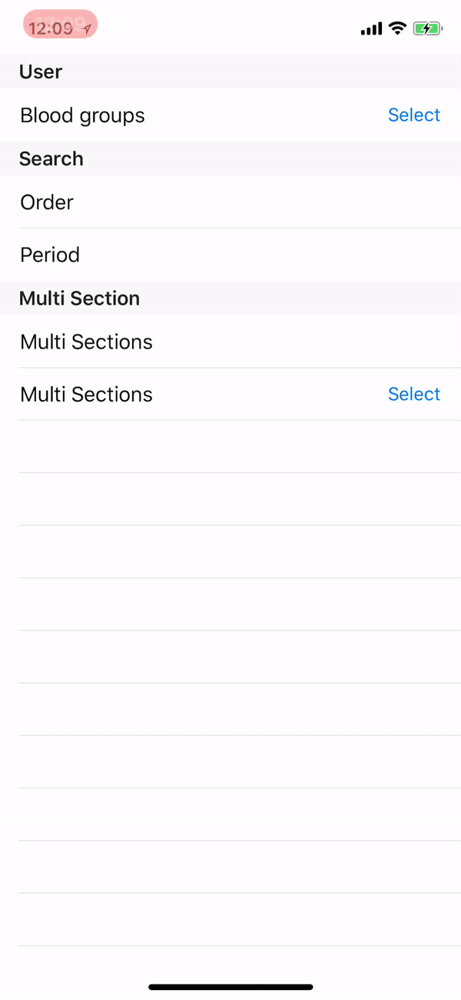

# JHDropDownMenu

[](https://swift.org)
[](https://travis-ci.org/tokijh/JHDropDownMenu)
[](http://cocoapods.org/pods/JHDropDownMenu)
[](http://cocoapods.org/pods/JHDropDownMenu)
[](http://cocoapods.org/pods/JHDropDownMenu)

## Introduction
Dropdown menu in UIView by extension



## Noti
JHDropDownMenu updated differently from 1.0.
If you used 1.0 you should modify code or use `pod 'JHDropDownMenu', '~> 1.0'`

## Example
To run the example project, clone the repo, and run `pod install` from the Example directory first.

## Installation
JHDropDownMenu is available through [CocoaPods](http://cocoapods.org). To install
it, simply add the following line to your Podfile:

```ruby
pod 'JHDropDownMenu'
```

## Usage
```
import JHDropDownMenu
```

Now you can use dropdown any UIView
```
let dropdown = UIView.getDropDown(T.self)
```

You can set items as follows
```
dropdown.set(items: [T], cellView: ((T) -> UIView))
```

Also you can set multiple section items as follows
```
dropdown.set(items: [[T]], cellView: ((T) -> UIView), sectionView: ((T) -> UIView?))
```

### Customize
You can customize `listView (UITableView)`
```
dropdown.setupListView: (UITableView -> Void)
```
**Also welcome to PR whenever.**

## Author
* [tokijh](https://github.com/tokijh)

## Thanks to
* [younatics](https://github.com/younatics)
* [YNDropDownMenu](https://github.com/younatics/YNDropDownMenu)

## License
JHDropDownMenu is available under the MIT License See the [LICENSE](LICENSE) file for more info.
