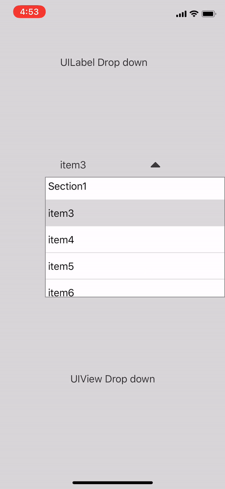

# JHDropDownMenu

[](https://github.com/tokijh/JHDropDownMenu/blob/master/LICENSE)
[](https://swift.org)
[](https://travis-ci.org/tokijh/JHDropDownMenu)
[](http://cocoapods.org/pods/JHDropDownMenu)
[](http://cocoapods.org/pods/JHDropDownMenu)
[](http://cocoapods.org/pods/JHDropDownMenu)

## Introduction
Dropdown menu in UIView by extension



## Example

To run the example project, clone the repo, and run `pod install` from the Example directory first.

## Installation

JHDropDownMenu is available through [CocoaPods](http://cocoapods.org). To install
it, simply add the following line to your Podfile:

```ruby
pod 'JHDropDownMenu'
```

## Usage
```
import JHDropDownMenu
```

Now you can use dropdown any UIView (maybe)
```
UIView().dropdown.set(items: [[...]])
```

Also you can customize dropdown menu using `option`
```
UIView().dropdown
    .option(id: Selection.uiViewDropDown.rawValue)
    .option(delegate: self)
    .option(selectorSize: (width: 300, height: nil))
    .option(marginVertical: 10)
    .set(texts: texts, sectionTitles: sectionTitles)
```

### Options
* `id: String?` Key for detect selector in delegate. default : nil
* `isActiveTapGesture: Bool` active tap gesture. default : true
* `dismissOnSelected: Bool` dismiss when selected. default : true
* `isOpen: Bool` open status. default : false
* `animate: Bool` animate when opening and closing. default: true
* `automaticRelocation: Bool` auto resize when open. default : true
* `contentMode: JHDropDownMenu.ContentMode` content direction. cases are 'center', 'left', 'right'. default : center
* `selectorSize: (width: CGFloat?, height: CGFloat?)` list(selector) size. default : (view.frame.width, 200)
* `marginVertical: CGFloat` margin with view and list(selector).  default : 0
* `blindView: UIView?` blindView when opening dropdown. 
* `delegate: JHDropDownDelegate?`

### Delegate
* ```func willChange(_ dropdown: JHDropDown, id: String?, view: UIView, isOpen: Bool)```

* ```func didChange(_ dropdown: JHDropDown, id: String?, view: UIView, isOpen: Bool)```

* ```func didSelectRowAt(_ dropdown: JHDropDown, id: String?, view: UIView, indexPath: IndexPath)```

### Customize
You can access `listView (UITableView)` by dropdown
```
UIView().dropdown.listView
```
**Also welcome to PR whenever.**

## Author
* [tokijh](https://github.com/tokijh)

## Thanks to
* [younatics](https://github.com/younatics)
* [YNDropDownMenu](https://github.com/younatics/YNDropDownMenu)

## License
JHDropDownMenu is available under the MIT License See the [LICENSE](LICENSE) file for more info.
